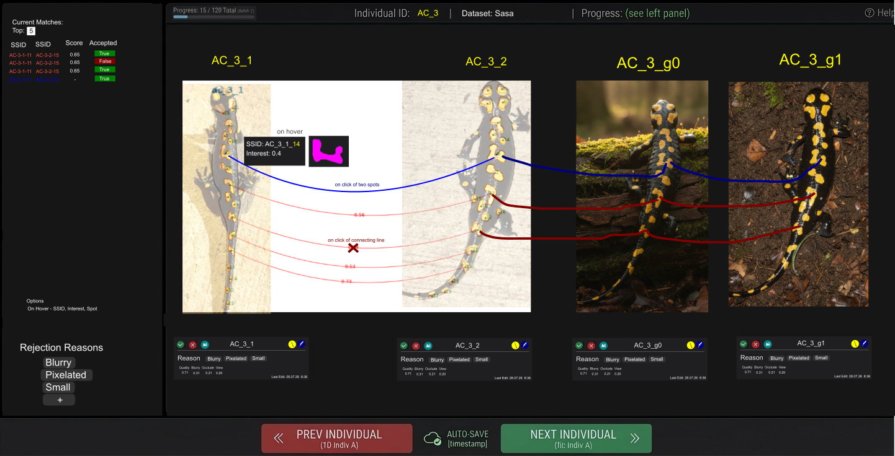

# Preprocessing UI — dataset refinement and spot-match curation

A single-page review app that walks one **individual at a time** (all of its photos side by side),
lets a human accept/reject each image into the dataset, delete duplicates, disqualify bad
machine-proposed spot matches, and add the ones the machine missed. It emits **one JSON file** that
every downstream consumer filters against.

Design context: [results.md](../results.md) §6–7, [project_goal.md](project_goal.md),
[sea_improvments.md](sea_improvments.md). This doc is the UI spec + the output contract.

## Why this tool

[results.md](../results.md) lesson #40 routes effort here rather than at architecture:

- **#10 — extraction is unstable.** 39 % of individuals' own repeat photos agree no better than
  two random animals do. No aggregator fixes that; a human deciding "this photo is unusable" does.
- **#9 — 54 suspected duplicate identities.** One animal filed under two labels is scored as a
  model error on every metric. Only a human can adjudicate.
- **#14 — filter the *evaluation*, not the *training pool*.** A rejected photo is a bad *query* but
  usually fine *training data*. The output must express those separately or it costs ~3× the
  training images.
- **#31 — human intuition, encoded, is load-bearing.** Removing the human special-spot supervision
  from the learned gate drops census F0.5 0.609 → 0.493 and novelty AUROC 0.666 → 0.516 (chance).
  More of that supervision is the highest-value thing a human hour can produce here.

### What it consolidates

Three existing local apps each do one slice; this is their union, organised by *individual* instead
of by image or by pair.

| existing tool | what it contributes | store |
|---|---|---|
| [interesting_spot_selector.py](../scripts/tools/interesting_spot_selector.py) — **replaced** | click→spot resolution, per-spot masks, the interesting-spot clicks | `artifacts/interesting_spots/<folder>/interesting_spots.json` |
| [spot_correspondence.py](../scripts/tools/spot_correspondence.py) | human spot↔spot links **and misses**, per pair | `artifacts/correspondence/<folder>/links.json` |
| [pair_review.py](../scripts/tools/pair_review.py) | ranked machine pairs + a free-text note per pair | `artifacts/pair_review/<dataset>/review.json` |

`CorrespondenceApp` uses `SpotSelectorApp` as a pure pixel service — click snapping and mask overlays
resolved in Python, one POST per click ([pipeline/correspondence/app.py](../pipeline/correspondence/app.py)).
**This UI does not**: with the contours in the browser, click→`spot_id` is a point-in-polygon test in
JS ([Technology](#technology)). `interesting_spots` is **replaced** by this tool, not wrapped by it.

---

## Technology

**One pixi task, one stdlib HTTP server, one HTML page.** No framework, no build step, no new
dependency — the same shape as the three tools this replaces, which are each exactly
`app.py` + `page.py` + `server.py` over `http.server`
([interesting_spots/server.py](../pipeline/interesting_spots/server.py),
[correspondence/server.py](../pipeline/correspondence/server.py)).

### Package layout

Its own subdirectory in `pipeline/`, mirroring its siblings:

```
pipeline/preprocessing/
    __init__.py     module docstring + exports (ReviewApp, run)
    app.py          state: individual index, DuckDB reads, machine matches, interest cache,
                    atomic save with the rev guard, legacy import/export
    page.py         INDEX_HTML — the whole single page (markup + CSS + JS in one string)
    server.py       ThreadingHTTPServer: GET data + photos, POST edits/export/interest
scripts/tools/preprocessing_review.py    thin argparse CLI, as the siblings have
```

```toml
# --- preprocessing review (local web app) — replaces interesting-spot-selector ---
preprocess-review   = "python scripts/tools/preprocessing_review.py"
preprocess-export   = "python scripts/tools/preprocessing_review.py export"
preprocess-interest = "python scripts/tools/preprocessing_review.py interest"
```

Same flags as the siblings so muscle memory transfers: `--dataset`, `--input <folder>` (the pipeline
DB instead of a packaged dataset), `--port`, `--no-browser`, plus `--store` / `--legacy` overrides and
`--no-interest`.

**Source of truth is the packaged dataset DB** — `datasets/<dataset>/db/contours.db`, because it is
the only one carrying `is_synthetic` *and* `spot_embeddings`, so the UI reads exactly what the
experiments read. Photos come from `datasets/<dataset>/raw/`. `--input` falls back to
`images/<folder>/contours/contours.db`, which has no embeddings, so that mode has no machine arcs and
the page says so.

**`?label=ac_3` opens (and links to) one animal**, and the URL follows navigation — so a specific
family is shareable and a refresh stays put.

### Where the logic lives

**All of it in the browser.** The page holds the entire [output contract](#output-contract) as one
in-memory object and mutates it; Python does two things only — hand over data, and write the file.

| in the page (JS) | in Python |
|---|---|
| click → `spot_id`: the spot outlines **are** `<path>` elements, so the browser's own hit test resolves it; a click that misses snaps to the nearest centroid within 4 % of the image width | one read-only DuckDB query per individual |
| overlays, arcs, interest ramp, hover, tooltips, keybindings | serve photo bytes; compute the machine matches (~20 ms/family) |
| every mutation, `done`, the `_q0.4` badge, the whole record shape | merge the posted record, recount, atomic write |
| review state, dirty tracking, the save queue | the interest cache and the two exports |
| — | **never a write to `contours.db`** (opened `read_only=True`) |

**Why click resolution moves to the front end.** The old selector POSTed every click because the
server owned the pixels (per-spot mask PNGs). Contours are *vectors* — `local_contour` is a
`DOUBLE[][]` polygon — so point-in-polygon is ten lines of JS with no latency, works while the next
individual is still loading, and means `spots.mask_png` (**449 MB** in the DB) never has to reach the
browser at all. Even the enlarged hover shape is that same polygon scaled into a 64 px box, filled
magenta, rather than a fetched PNG.

### SVG overlay, not canvas

Each card is an `` with one `<svg>` layer over it; every spot is a `<path>`. Hover hit-testing,
the [interest ramp](#the-interest-ramp) fill, alpha, the arc dash patterns and transitions are then
CSS, and arcs are `<path>` béziers between two centroids in the same coordinate space. Canvas would
mean hand-writing hit-testing for the one interaction the whole tool is built around. Volume is not a
concern: `ac_3` is 4 images and **79 spots** total.

### Data transport — per individual, not one bundle

Measured on `images/all_sasa_norm/contours/contours.db` (1869 images, 40 185 spots, **3.8 GB**):

| payload | size | how it travels |
|---|---|---|
| one individual's geometry — spots, contours, axis polylines, quality, machine matches | **86 KB** as served (`ac_3`: 4 images, 79 spots) | `GET /api/individual?label=ac_3` |
| the same before decimating the body outlines | 186 KB — outlines are ~1000 points each and 80 % of the payload | capped at 250 points/side |
| the whole dataset's geometry as one JSON | ≈ **114 MB** (6.4 M outline points) | not shipped |
| `spots.mask_png` | 449 MB | never leaves the DB |
| photos | on demand, `Cache-Control: public, max-age=86400` | `GET /photo?sid=` |
| `review.json` + the individual index | small (decisions only) | `GET /api/bootstrap` once, then patches |

So the page fetches **per individual and prefetches the next one** while the reviewer works. "All the
data in the browser" means all the data for the animal on screen — which is exactly the unit the
family view operates on, and it keeps paging instant on a 3.8 GB store. A fully static `--export`
(geometry decimated to every 8th outline point, ≈10 MB gzipped) is possible for sharing a read-only
snapshot, but it cannot save — see below.

### Interest is cached, because it is a whole-dataset number

The fill score is `strict_match.distinctiveness` — and its factors are **percentile ranks over the
population**, so it cannot be computed per family without changing what the number means (every animal
would own a spot at 1.0). Measured cost over the 40 185 spots of `all_sasa_norm_2026_23_07`: **235 s**.

So it is computed once and cached to `artifacts/preprocessing/<dataset>/interest.json`. The server
kicks the build off in a **daemon thread** on startup when the cache is missing; until it lands the
page renders a flat fill and says so under the ramp legend, and picks the scores up on the next
individual it loads. `pixi run preprocess-interest` does it in the foreground; `--no-interest` skips it.

Machine matches need no cache: cosine similarity on the 62-d `spot_embeddings` of one family is ~20 ms,
so arcs are computed per request and the matcher selector is instant.

### Saving on every edit

"Front-end only" and "writes a JSON file on every edit" cannot both be literally true: a page cannot
write to a path. The split that makes both true in practice:

1. **every mutation applies locally first** — the UI never waits on the network;
2. it enqueues a `POST /api/edit` carrying the **individual-level patch**, coalesced on a ~300 ms
   debounce and flushed immediately on individual change, tab blur and `beforeunload`;
3. the server merges the patch and writes atomically — `.tmp` + `os.replace`, the same helper as
   [correspondence/app.py:107-121](../pipeline/correspondence/app.py#L107-L121);
4. the response returns `rev` + `updated_at`, which is what the ☁ AUTO-SAVE stamp renders. A failed
   save turns the stamp **red** and the page keeps retrying — losing forty minutes of hand labels to a
   dropped socket must be impossible.

Two safeguards worth the few lines they cost:

- **`rev` is a guard, not decoration.** The page sends the rev its edit was based on; the server
  returns `409` if the file has moved on (a second tab, a second reviewer, a stale page left open
  overnight). Last-write-wins is fine for a preferences file and wrong for one holding hours of
  irreplaceable labels.
- **The pending queue is mirrored to `localStorage`**, so a browser crash between mutation and
  successful POST is recoverable rather than silent.

The only file the server writes is `artifacts/preprocessing/<dataset>/review.json` (plus the
`reprocess/*.csv` exports on request). `contours.db` is opened `read_only=True`.

*Serverless fallback, if it is ever needed:* the File System Access API can hold a file handle from
one `showSaveFilePicker` and write on every edit — Chromium-only and it needs a user gesture per
session, so it is not the default, but it does make the exported page fully self-contained.

### What this replaces, and how the old labels survive

- **`pipeline/interesting_spots/` and `pixi run interesting-spot-selector` are superseded.** One click
  there is the same gesture as [Flow 8](#flow-8--create-a-match-across-several-salamanders) here, and
  this tool additionally records *which spot in which other photo* — something the old store cannot
  express at all.
- **On first run, import the old store.** `artifacts/interesting_spots/<folder>/interesting_spots.json`
  (**2521 clicks over 385 images**, measured) seeds the `interesting_spots` block and draws the rings
  on the canvas. Every click is imported, including the 23 images no longer in the packaged dataset —
  they round-trip through the export untouched rather than being silently dropped.
  Those clicks are the supervision lesson #31 measures as load-bearing — they are imported, never
  re-derived and never discarded.
- **Keep writing the legacy path.** `preprocess-export` emits the derived block back to
  `artifacts/interesting_spots/<folder>/interesting_spots.json` in its existing shape, so
  `strict_hand` / distinctiveness consumers keep reading the file they already read and no downstream
  code changes with this tool.
- **Retire the old task only after a full pass through the new one.** Deleting a labelling tool before
  its replacement has produced a complete dataset is how label collections get lost.
- `pipeline/correspondence/` and `pair_review.py` stay: `correspondence-analyze` is analysis this UI
  has no equivalent for yet.

---

## Screen layout

Five fixed regions. Colours, type and per-component detail are in
[Visual language](#visual-language); this section is structure only.

```
┌──────────────────────────────────────────────────────────────────────────────┐
│ ▓▓▓▓▓░░░ 15 / 120 Total │ Individual ID: AC_3 │ Dataset: Sasa │  ⓘ Help      │
├───────────────┬──────────────────────────────────────────────────────────────┤
│ Current       │   AC_3_1        AC_3_2        AC_3_g0       AC_3_g1          │
│ Matches       │  ┌────────┐    ┌────────┐    ┌────────┐    ┌────────┐        │
│  Top: [5]     │  │        │╲___│        │╲___│        │╲___│        │        │
│  SSID Score A │  │  ●  ●  │────│  ●  ●  │────│  ●  ●  │────│  ●  ●  │        │
│  …    0.85 ✓  │  └────────┘    └────────┘    └────────┘    └────────┘        │
│  …    0.68 ✗  │  ✓ ✗ ⓣ ⓓ ⓐ ⓟ   ✓ ✗ ⓣ ⓓ ⓐ ⓟ   ✓ ✗ ⓣ ⓓ ⓐ ⓟ   ✓ ✗ ⓣ ⓓ ⓐ ⓟ       │
│               │  Reason chips  Reason chips  Reason chips  Reason chips      │
│ Options ⚙     │  Qual .71 q✗   …             …             …                 │
│ Rejection  +  │  Last Edit …                                                 │
│ Reasons       │                                                              │
│ Quality table │                                                              │
│ ▁▂▃▄▅ 0 → 1   │                                                              │
├───────────────┴──────────────────────────────────────────────────────────────┤
│      « PREV INDIVIDUAL (AC_2)   ☁ AUTO-SAVE [11:30:45]   NEXT (AC_4) »       │
└──────────────────────────────────────────────────────────────────────────────┘
```

Footer glyphs, in order: `✓` accept · `✗` reject · `ⓣ` train · `ⓓ` delete (duplicate) ·
`ⓐ` re-run anatomy extraction · `ⓟ` re-run purple spot extraction. `q✗` is the `_q0.4` badge, and
`▁▂▃▄▅ 0 → 1` is the [interest ramp](#the-interest-ramp) legend. Real icon designs:
[D. Per-card footer](#d-per-card-footer).

### A. Top bar

| element | source |
|---|---|
| progress bar + `15 / 120 Total` (optionally `(Batch 1)`) | count of individuals with `done: true` |
| `Individual ID: AC_3` | `derive_label(salamander_id)` — the stem minus the trailing instance |
| ✗ beside the ID | individual-level reject, cascading to unreviewed images ([Flow 2](#flow-2--reject-a-salamander-with-a-reason)) |
| ⓓ beside the ID | this label is the same animal as another → merge + soft delete ([Flow 9](#flow-9--delete-a-duplicate)) |
| `Dataset: Sasa` | `datasets/<name>/` |
| `ⓘ Help` | keybinding cheatsheet |

### B. Left sidebar (collapsible, ☰)

Four stacked panels: **Current Matches**, **Options**, **Rejection Reasons**, **Quality**.

#### Current Matches — a live table

One row per match **edge**: `SSID | SSID match | Score | Acc | ✕`. It is **dynamic**: it re-renders
whenever the canvas changes — a new human match appears at the top the instant the arc closes, a
rejection restyles its row in place, changing **Top: [n]** adds or drops machine rows, and switching
matcher re-populates them.

- **`Top: [n]` is an input**, not a dropdown — a small light-on-dark number field in the panel
  header (the mockup's one inverted control, which is what makes it findable). It caps machine
  matches **per image pair**; human matches are never capped and never counted against it.
- **Row colour is provenance.** Both SSID cells take the **arc's own colour**
  ([Arc colours](#arc-colours--one-per-proposer)) — so a row and its line are obviously the same
  object, and two matchers in one file are told apart in the table as well as on the canvas. SSIDs are
  monospaced and tabular so the columns line up; nothing else in the row is coloured.
- **`Acc` is an icon pill** — green ✓ / red ✗, clickable, same action as clicking the arc.
- **`✕` is a fifth column: dismiss, not reject.** On a human match it is an undo (remove it — it was a
  mis-click). On a machine proposal it drops the row **and remembers the edge** in
  `individuals.<label>.dismissed`, so re-running or switching matcher does not resurrect it. Rejecting
  via the pill is the *other* action and the one that preserves hard negatives; the ✕ tooltip says so,
  because confusing the two would quietly destroy the most valuable label this UI produces.
- **Type two SSIDs to add a match** — `AC-3-1-14` + `AC-3-2-15` + `add`, for when you know the pair and
  do not want to hunt for the blobs. An SSID that is not a real spot in this family is **refused**, never
  invented, and both must be different photos.
- **Long lists collapse** at 12 rows behind `Show all N`.
- **SSID** — `<letters>-<individual>-<instance>-<spot_id>`, e.g. `AC-3-1-14`. See [SSID](#ssid).
- **Score** — the matcher's per-spot similarity; `–` for a human match (no score, as in the
  mockup). A rejected edge keeps its score, struck through, with an ✕ over it.
- **Accepted** — green `True` / maroon `False` pill, sharp-cornered. **Defaults to `True`**: a
  proposed match is accepted until a human rejects it. Same state as the arc's ✕ on the canvas;
  clicking the pill is the same action as clicking the arc.
- **No `By` column.** Row colour already carries provenance in a 250 px panel. `proposed_by` /
  `method` still ship in the file, and the row tooltip spells them out ("`raw`, score 0.653, proposed
  08:31") — which satisfies the never-colour-alone rule without another column.
- **Sort** — score descending by default; click a header to re-sort (human rows, having no score,
  sort as a block at the top). Selecting a row highlights its arc and vice versa.
- **Misses (n)** — a short list beneath the table, one row per miss (`SSID → image`), so recorded
  misses are visible and removable ([Flow 10](#flow-10--mark-a-miss)). They are not matches: there
  is no second SSID and no score, so they do not belong in the table.

#### Options — a live configuration panel

Everything here takes effect **immediately** on the current view and is persisted in `ui`
([output contract](#output-contract)). No apply button, no modal, no page reload — it is a settings
panel you leave open while reviewing, because most of these are things you flip several times per
individual.

| control | writes | note |
|---|---|---|
| **View** — `photo` · `normalized` (key `N`) | `ui.normalized_view` | pose-free rendering ([Normalized view](#normalized-view-n)) |
| **Matcher** — `raw` · `logreg` · `strict_hand_pos` | `ui.matcher` | which matcher proposes the machine arcs ([Flow 7](#flow-7--disqualify-a-bad-match)); `raw` is the default |
| **Score cutoff** slider | `ui.match_cutoff` | hides arcs below it without deleting anything |
| **On hover** — `SSID`, `Interest`, `Spot`, `Head dist` | `ui.tooltip_fields` | which lines the spot tooltip shows ([C](#c-canvas--the-family-view)) |
| **Overlay toggles** ×5 + **photo opacity** | `ui.overlays`, `ui.photo_opacity` | the same five layers as [Flow 6](#flow-6--toggle-any-overlay-off) — they live here rather than in a floating widget |
| **Spot fill** — interest gradient on/off, fill alpha | `ui.spot_fill`, `ui.spot_fill_alpha` | [Interest ramp](#the-interest-ramp) |
| **Reviewer** | `reviewer` | stamped into every record |

#### Rejection Reasons

Runtime-editable enum — `Blurry`, `Pixelated`, `Small`, and a `+ Add reason` chip that appends a new
one and makes it available on every card immediately ([Flow 3](#flow-3--add-a-rejection-reason)).
The live list is written into the output file so old files stay readable after the enum grows.

#### Quality — the family table at the bottom

The per-card footers show four numbers each; the **bottom panel shows the whole family in one
table**, one row per image, so the reviewer compares photos instead of remembering them:

| img | Qual | Sharp | Spots | Body | q0.4 |
|---|---|---|---|---|---|
| `AC_3_2` | 0.38 | 0.55 | 0.44 | 0.29 | ✗ |
| `AC_3_1` | **0.71** | 0.31 | 0.21 | 0.20 | ✓ |
| `AC_3_g0` | – | – | – | – | ✓ᵍ |

Column names are the settled ones — **every column is a *quality*, higher = better**, which is why
`Sharp` rather than the mockup's `Blurry` ([mapping](#the-quality-readout-needs-an-explicit-mapping)).

- **Values are normalized against the dataset**: the grey ramp is driven by each number's
  **percentile** among all real photos, not by an absolute 0–1 scale, so a dark cell means "bad for
  this dataset". The last row is the **dataset mean** itself, so "good" has a reference on screen.
- **Sorted worst-first** — the same principle as the review order over individuals
  ([Flow 1](#flow-1--advance-and-resume-where-you-left-off)): the photo you are most likely to reject
  is the top row.
- Cells carry a **neutral grey background ramp** (darkest = worst, `#2A2A2A → #6E6E6E` on the dark
  panel), so a bad column is findable without reading twenty digits. Grey deliberately: amber is
  [interest](#the-interest-ramp), blue and red are provenance, maroon is rejection — quality is the
  fourth magnitude on this screen and the only hue left that means nothing else is none. The numbers
  stay in normal ink on top of the ramp, never in the ramp colour.
- `–` where `image_quality` has no row; `✓ᵍ` where the `_q0.4` tick is inherited rather than earned
  ([Flow 4](#flow-4--see-every-quality-score-the-db-holds)).
- Clicking a row selects that card; clicking a **column header** sorts by it — the fastest way to
  answer "which photo of this animal is the blurry one".
- Read-only. Every number is precomputed by `compute-quality`; the UI never writes to
  `image_quality`.

### C. Canvas — the family view

One card per image of the individual, **real photos first, synthetic (`_g*`) last**.

- **Overlays — five independent layers, each individually toggleable** (spots, outline, spine,
  head/tail anchors, match arcs) plus a photo-opacity slider; the mockup shows one card half
  overlay-only, half photo. Full layer table in [Flow 6](#flow-6--toggle-any-overlay-off).
- **Spot fill = interest, as a faded gradient.** Every spot is filled with its interest score on a
  one-hue amber ramp at ~45 % alpha, so the photo reads through it and the fill never hides the
  pattern it is describing. Full spec + the ramp itself: [Interest ramp](#the-interest-ramp).
- **Hover on a spot — four things happen at once:**
  1. **the outline pops** — its edge goes to full opacity, ~2.5 px, with a 1 px white halo so it
     survives any background the photo happens to have there, and its fill alpha lifts one notch.
     This is the primary hover cue; the tooltip is secondary, because the outline is what tells you
     *which* blob the numbers are about;
  2. **the tooltip** appears beside it — `SSID: AC-3-1-14`, `Interest: 0.4`, `Head: 0.31 (312 px)`;
  3. **an enlarged magenta shape** of the spot — `spots.mask_png` scaled to a fixed box (~64 px) in
     its own black panel beside the tooltip, as in the mockup. Enlarged is the point: a 12 px blob
     on the photo is unjudgeable, and shape is what the matcher is actually comparing;
  4. every **arc touching that spot** highlights, in both the canvas and the match table.
- **`Head: 0.31 (312 px)` — distance from the head**, along the body, not in the image. `axis_t` is
  the fraction head→tail (0 = head, 1 = tail tip) and the pixel figure is `axis_t × length_px`
  measured along `body_axis.midline_*` — the same curve the overlay draws. It is the one number that
  makes two photos of a bent animal comparable by eye, and it is free (`spots.axis_t`,
  `body_axis.length_px`). Show `Side: left` beside it when `axis_side` is set: *head distance + side*
  is nearly the whole of how a human decides two spots are the same spot.
  Bracket it as `~` when `body_axis.judged_ok` is false — a distance measured along a bad axis is
  worse than no distance, and the reviewer must be able to see which case they are in.
- **Match arcs across adjacent cards**:
  - **Blue = human-proposed** — click spot A, then spot B.
  - **Red = machine-proposed** — score printed on the arc (`0.56`, `0.53`, `0.71`). *Which* matcher
    proposes them is the sidebar's **Matcher** selector, `raw` by default
    ([Flow 7](#flow-7--disqualify-a-bad-match)).
  - Every arc is **one connection between two photos**. A spot carried across four cards is three
    separate arcs, each removable on its own ([Flow 8](#flow-8--connect-two-spots)).
- **Arc rejection** — click the line → red **✕**. Equivalent to `Accepted → False` in the table.
- **Blue dashed stub = a miss** — leaves a spot's centroid, ends in an open circle on the card where
  that spot was never extracted. Deliberately *not* an arc: a miss has no spot at the far end
  ([Flow 10](#flow-10--mark-a-miss)).
- **Three click states per spot** — `unselected` → `selected` (it turns **purple**) → terminated. A
  second spot on another card terminates it as a **connection** (blue line, and both spots deselect —
  [Flow 8](#flow-8--connect-two-spots)); `M` plus a click on another card terminates it as a **miss**;
  clicking it again, or `Esc`, deselects.
- **Hovering an arc pops it** — the stroke widens ~2 px and takes a white glow, and a tooltip gives
  `SSID → SSID`, the score, and which matcher proposed it. Only the spot outlines and the arcs take
  clicks; centroid dots, numerals, rings and the body layers are `pointer-events: none`, because a
  decoration painted on top of a spot must not swallow a click aimed at the spot's centre.
- **Hold `Ctrl` to click through the arcs.** With five arcs per gutter, the thing you want to click is
  often under one. Ctrl disables hit-testing on the arc paths only — the spot underneath receives the
  click. (It has to name the paths: `#arcs` is already `pointer-events:none`, and a child that sets
  `stroke` overrides a parent's `none`.)

#### Normalized view (`N`)

A second rendering of the same family, with **pose removed**: the body axis is a straight vertical
line, the **head is a green disc at the top and the tail a red disc at the bottom**, always, and every
spot sits at its body-frame coordinate — `y = axis_t` (0 head … 1 tail), `x` = lateral offset in
half-widths (`axis_offset / (avg_width_px/2)`, clamped to ±2.6). Spot *shapes* are drawn at their true
relative size (`contour × span / length_px`), so two photos of a bent animal become directly
comparable — which is what `axis_t` / `axis_offset` exist for.

- Arcs, matches, misses and every click work identically; the card writes its own viewBox onto the
  wrapper, so the arc layer maps positions the same way in either view.
- Cards are narrower here (196 px), which also puts more animals on screen — the point of a pose-free
  frame is comparison.
- A photo with no `body_axis` says **"no body axis"** rather than inventing positions; a spot with a
  null `axis_t` is omitted from this view only.
- `partner_xy` on a miss is a *source-pixel* location, so in this view the stub aims at the middle of
  the axis instead of pretending to know where it was.

### D. Per-card footer

Six circular buttons: four decisions on the left, two re-extractions on the right.

| control | icon | meaning |
|---|---|---|
| **✓ accept** | green disc, white check | `decision = "accept"` → `eval_ok: true`, `train_ok: true` |
| **✗ reject** | red disc, white ✗ | `decision = "reject"` → `eval_ok: false`; `train_ok` untouched ([Flow 2](#flow-2--reject-a-salamander-with-a-reason)) |
| **ⓣ train** | teal disc | **toggle** on `train_ok` — "put this photo in the training set", independent of the accept/reject call (#14) |
| **ⓓ delete** | grey disc, bin | this photo duplicates another → soft delete; sets `eval_ok` **and** `train_ok` false ([Flow 9](#flow-9--delete-a-duplicate)) |
| **ⓐ anatomy** | yellow disc holding a green head dot, a grey spine path and a red tail dot | queue a re-run of **anatomy extraction** — `correct_axis` (free) or `reextract_body` ([Flow 5](#flow-5--queue-a-re-extraction-anatomy--purple)) |
| **ⓟ purple** | purple disc, white salamander | queue a re-run of **purple spot extraction** (`repurple`) |
| **⟳ regenerate** | blue disc, refresh arrow | *real cards only* — regenerate synthetic views from this photo. **Runs now and is billed** ([Flow 11](#flow-11--regenerate-a-bad-synthetic)) |
| `miss` | text button beside the chips | with a spot selected, records a miss ([Flow 10](#flow-10--mark-a-miss)); key `M` |
| Reason chips | | multi-select from the sidebar enum; quick keys `0 1 2 3` |
| Quality readout + `q0.4` badge | | read-only decision support; click to expand to every column, the free-text note and the ⚠ second-opinion flag ([Flow 4](#flow-4--see-every-quality-score-the-db-holds)) |
| `Last Edit 28.07.26 8:36` | | per-image `reviewed_at` |

**The two re-extraction icons name their own pipelines.** The anatomy disc *is* a tiny anatomy —
head dot, spine, tail dot, the exact three things `correct_axis` re-derives — and the purple disc is
the colour of the magenta/purple spot key. Neither needs a label, and they are deliberately the only
two buttons on the right, physically separated from the four decisions: one group changes the
*record*, the other asks for the *data* to be recomputed.

**There is no `○` unreviewed button.** Unreviewed is the *absence* of ✓/✗ — every card's initial
state — so it needs no control, and pressing ✓ or ✗ again clears back to it. That frees the slot for
ⓣ train, which is the axis the schema genuinely needs a second bit for (#14): a photo can be a bad
query and good training data, and one accept/reject bit cannot say so.

**The card border is the decision.** Accept turns the whole card's border **green**, reject **red**,
and a card excluded from training goes **dashed grey**; the border animates once, on the card that
changed, so a click is confirmed without moving your eyes to the footer. The state of a whole family
is then readable at a glance, which is what makes a 751-individual pass survivable. Buttons are dim and
desaturated when off, full-colour with a ring when on — the toggle state is legible without reading the
icon — and rejection reasons stay selected across it.

**Quality is shown relative to the dataset.** Under each number is its distance from the mean over
every real photo (`+0.52`, `−0.34`), green above / red below, with the percentile and z-score in the
tooltip. `0.83` alone is not a decision; `0.83, +0.21 above the mean, 78th percentile` is
([Flow 4](#flow-4--see-every-quality-score-the-db-holds)).

**On synthetic (`_g*`) cards** ⓣ is locked on and ✗ still means "this generated view lost the
pattern"; `eval_ok` is locked `false` regardless (#11).

### E. Bottom bar

`« PREV INDIVIDUAL (ID: AC_2)` · `☁ AUTO-SAVE [11:30:45]` · `NEXT INDIVIDUAL (ID: AC_4) »`.
No explicit save. Add a **jump-to-next-unreviewed** key (`U`, as in the interesting-spot selector).

---

## Visual language

Extracted from the annotated mockup, [ui.png](ui.png) (1442 × 736; `ui.svg` is the source).



The grey callouts in the image — *"on hover"*, *"on click of two spots"*, *"on click of connecting
line"* — are spec commentary, not chrome. Everything else below is.

### Palette

| token | hex | used for |
|---|---|---|
| page / sidebar / topbar bg | `#161616` | the whole shell, one flat near-black |
| raised panel | `#1F1F21` | card footers **and** the hover tooltip |
| chip | `#333333` | rejection-reason chips |
| card panel | `#FFFFFF` | the photo card — pure white, the only large light area |
| identity yellow | `#FFFF00` | card titles, `Individual ID`, the spot-id segment of the SSID |
| human blue | `#3987e5` | human-proposed arcs, their table rows, the pending-spot highlight and the miss stub — **one** blue, the validated arc hue, not the mockup's `#0000FF` alongside it |
| machine red | `#e66767` (score ink `#BA4040`) | machine-proposed arcs and their table rows ([Arc colours](#arc-colours--one-per-proposer)) |
| reject maroon | `#800000` | the ✕, the `False` pill, and the thick arcs |
| accept green | `#008000` | the `True` pill |
| teal | `#008080` | the ⓣ train toggle |
| anatomy disc | `#FFD24A` | the ⓐ button — desaturated off identity yellow (issue 7); its icon dots are `#008000` head / `#8A8A8A` spine / `#C00000` tail |
| repurple purple | `#8A2BE2` | the ⓟ button — the purple-extraction stage it re-runs. **Blue in the mockup, which is wrong**: blue means "a human said so" everywhere else (issue 9) |
| delete grey | `#5A5A5A` | the ⓓ button — deliberately *not* maroon; deleting a duplicate is not a rejection |
| key magenta | `#FF00FF` | the spot-mask thumbnail — the extraction pipeline's key colour, reused verbatim |
| PREV maroon | `#893332` | previous-individual button |
| NEXT green | `#367950` | next-individual button |
| progress steel | `#6495AD` | the top-bar progress fill |
| body mask | `≈#B0A49B` | translucent warm grey over the animal |
| spot fill / outline | `#EAD7AD` / `≈#DC9C54` | cream spot interiors, amber edges — re-stepped into the [interest ramp](#the-interest-ramp) |

### Arc colours — one per proposer

Each matcher draws in its own colour, with a dash pattern as the redundant cue:

| arc | colour | dash | why |
|---|---|---|---|
| human | `#3987e5` | solid, 3 px | a human said so — the thickest line, drawn on top |
| `raw` | `#e66767` | `7 4` | the default matcher; machine red, as the mockup has it |
| `strict_hand_pos` | `#199e70` | solid, 2 px | solid because its assignment **is** one-to-one — a spot cannot claim three partners |
| `logreg` | `#e66767` | `2 4` | machine red **dotted**: logreg has no spot-level output, so its arcs *are* raw pairs it scored |
| rejected (any) | `#B03A3A` | `3 5` | plus the ✕ over the score |

Those three hues are validated all-pairs against the dark shell (`scripts/validate_palette.js`:
normal-vision ΔE 20.9, CVD ΔE 6.5 — the warn band, which the per-matcher dash covers as secondary
encoding). **A fourth hue was tried and dropped**: nothing left in the ramp cleared the normal-vision
floor of 15 against machine red (orange came in at 7.1, yellow at 13.0), and a palette where two
matchers are indistinguishable is worse than one where the fourth is dotted. `logreg` sharing machine
red is not a compromise — it is the honest encoding of a matcher whose arcs are borrowed.

A **legend** under the match table lists only the proposers actually on screen.

### What each colour *means*

The mockup is consistent about this, and it is the part worth preserving:

- **Blue = a human said so. Red = a machine said so.** It holds in both places at once — the arc on
  the canvas *and* the SSID text in the sidebar table. Provenance is legible without reading a word.
- **Yellow = identity.** Card title, individual ID, and — nicely — the `14` in
  `SSID: AC_3_1_14` is yellow while the rest of the string is white, so the tooltip shows you *which
  part of the SSID is the spot*.
- **Maroon = rejection.** The ✕ over a score and the `False` pill are the same `#800000`.
- **Magenta = the mask itself**, carried straight over from the magenta-key extraction trick.

### The interest ramp

Spot fill encodes **interest** — one continuous magnitude, `strict_match.distinctiveness` ranked over
the whole dataset ([cached](#interest-is-cached-because-it-is-a-whole-dataset-number)) — so it gets a
**single-hue ramp, light→dark, in five bins**, and nothing else on screen uses that hue:

| interest | fill | meaning |
|---|---|---|
| 0.0 – 0.2 | `#CFAC6B` | ordinary spot |
| 0.2 – 0.4 | `#BE9450` | |
| 0.4 – 0.6 | `#A87A33` | |
| 0.6 – 0.8 | `#8B5C1B` | |
| 0.8 – 1.0 | `#6E480F` | the machine thinks this spot identifies the animal |

- **Amber, because every other hue is already spoken for.** Blue = a human said so, red = a machine
  said so, magenta = the mask, yellow = identity, maroon = rejection. A blue or red interest ramp
  would overwrite the provenance channel, which is the one piece of colour semantics in this UI that
  must not become ambiguous.
- **Five bins, not a continuous ramp.** These fills sit on a textured gravel photograph at partial
  alpha; a continuous ramp is unresolvable against that background, whereas five steps with visible
  lightness gaps survive it. The ramp is also **binned so the legend is real** — five swatches
  labelled `0 → 1` under the sidebar's quality panel, not a gradient bar nobody can read a value off.
- **Faded and see-through, by default.** Fill alpha ≈ **0.45** (`ui.spot_fill_alpha`, adjustable in
  [Options](#options--a-live-configuration-panel)); the fill is overlaid on the evidence, and a
  reviewer who cannot see the photo through it cannot judge the extraction. The **outline stays
  opaque** at the ramp's darkest step, so a low-interest spot's *shape* is never lost even as its
  fill recedes — magnitude fades, geometry does not.
- **The number is the source of truth.** Those hexes are validated as opaque swatches against both
  the light card and the dark sidebar (single hue, monotone lightness, all adjacent ΔL ≥ 0.06, light
  end ≥ 2:1 — `scripts/validate_palette.js --ordinal`, both modes). At 45 % alpha over an arbitrary
  photograph **no contrast guarantee is possible**, so the ramp is a *cue for scanning*; `Interest:
  0.4` in the hover tooltip is what a decision is made on. Say the number, never colour alone.
- **The human click is not on this ramp.** A spot a reviewer marked interesting keeps its **ring**
  (a shape cue, not a hue), so model score and human label can be compared at a glance instead of
  competing for the same channel — which is the whole point of showing both (#31).
- The ramp is off when `spots` is toggled off, and can be switched to a flat fill in Options for
  reviewers who find any fill distracting.

### Typography and density

Sans-serif throughout (Arial/Helvetica-class), no serif or mono anywhere. Roughly five sizes:
card titles (largest) → `Rejection Reasons` → table headers and `Reason` → body/table rows → the
quality grid and `Last Edit` (very small). Button labels are **uppercase bold with a smaller
parenthetical subtitle** on a second line (`NEXT INDIVIDUAL` / `(fil: Indiv A)`).

### Component notes

**Top bar** — one thin strip. Far left, an inset progress panel: `Progress: 15 / 120 Total` with
`(Batch 2)` in smaller grey, and a steel-blue bar beneath it, ~25 % filled. Centre, a group split by
thin vertical pipes: `Individual ID: AC_3` (value in yellow) │ `Dataset: Sasa` │ `Progress: (see
left panel)` (value in green). Far right, a dim `ⓘ Help`.

**Sidebar** — separated from the canvas by a vertical rule; no visible hamburger in this mockup.
`Top: 5` is a **light input box on dark**, the only inverted control in the panel, which is what
makes it findable. The match table is four columns with wide gutters; header row in white; **both
SSID cells carry the row's provenance hue** (`#FF9393`-class red for machine rows, saturated blue for
human ones — see the crop); scores white and centre-ish, `-` for a human row; `Accepted` cells are
small **solid rectangular pills, sharp-cornered**, white text on `#008000` / `#800000`. Then a large
empty gap, `Options / On Hover - SSID, Interest, Spot` as plain small text — which the spec expands
into a [live configuration panel](#options--a-live-configuration-panel) — another gap, then
`Rejection Reasons` over a vertical stack of rounded grey chips, each sized to its own label, ending
in a `+ Add reason` chip. Below that, new to the spec: the
[family quality table](#quality--the-family-table-at-the-bottom) and the interest-ramp legend.

**Cards** — four equal-width white panels in a row, top-aligned, yellow title centred above each.
Photos are portrait, animal head-up. The family reads left→right: real photos first (`AC_3_1`,
`AC_3_2`), then synthetic (`AC_3_g0`, `AC_3_g1`) — and the synthetic pair is visibly *not* overlaid,
which is itself a useful tell.

**Overlays on the photo** — four stacked layers, exactly the ones Flow 6 toggles: a translucent warm
grey **body mask** over the animal only (background gravel stays original), a thin dark **outline**
tracing it, **spots** as translucent fills on the [interest ramp](#the-interest-ramp) with opaque
amber edges, and small **green centroid dots with green numerals** giving each spot's id. The source
photo also carries a faint blue-grey watermark of its own stem (`ac_3_1`) top-left.

**Tooltip** — a flat `#1F1F21` box, white text, sharp corners in the mockup crop (rounded is fine),
with a **pointer** tying it to the hovered spot, placed to its right. The magenta mask thumbnail is a
**separate box beside it**, not inside it — same height, small gap between — and it is **enlarged**,
not thumbnailed: a fixed ~64 px box regardless of the spot's real size, because judging shape is what
it is for. Lines: `SSID: AC-3-1-14` (spot segment in yellow), `Interest: 0.4`, `Head: 0.31 (312 px)`,
`Side: left`. Which lines appear is `ui.tooltip_fields`.

**Arcs** — smooth béziers that leave a spot's centroid marker and sag across the gutter into the next
card. Three distinct weights are visible: thick saturated **blue** (human, drawn on top), thin pale
**pink** carrying its score inline at the arc midpoint, and thick **maroon** arcs between the later
cards. The ✕ is thick, maroon, and centred *on the score label*, covering it.

**Card footer** — a `#1F1F21` panel, sharp corners. Row 1: **four** circular icon buttons left
(green ✓ accept, red ✗ reject, teal ⓣ train, grey ⓓ delete), image stem centred in white, **two**
circular re-extraction buttons right (yellow ⓐ anatomy, purple ⓟ repurple — blue in the mockup, which
is wrong; issue 9); a thin rule under it. Row 2: `Reason` + three grey chips + the `miss` button.
Row 3: a tiny four-column metric grid, labels above values, `q0.4` badge at its end — the mockup crop
reads `Reason / Blur / Blur / Occ / View` over five numbers, which is a slip on two counts (`Blur`
twice, and `Reason` heading what is plainly `overall_quality` 0.71); the four intended columns and
[what they map to](#the-quality-readout-needs-an-explicit-mapping) are `Qual / Sharp / Spots / Body`.
Row 4:
`Last Edit: 28.07.26 8:36`, right-aligned, smallest text on screen.

**Bottom bar** — three centred elements: a wide maroon `PREV INDIVIDUAL «` button, a cloud-with-green-
check `AUTO-SAVE [timestamp]` indicator, and a wide green `NEXT INDIVIDUAL »` button. Corners rounded
~6 px. Both button colours are **desaturated** — PREV is not an alarm red, which is right: going back
is not destructive.

### Visual issues to resolve

1. ~~**`#800000` is overloaded**~~ — **resolved**: rejected arcs are their own colour and dash
   (`#B03A3A`, `3 5`) plus the ✕, and no accepted arc uses maroon
   ([Arc colours](#arc-colours--one-per-proposer)).
2. ~~**Three arc weights, two documented meanings**~~ — **resolved**: weight is provenance (human
   3 px, machine 2 px), dash is the matcher, and the third state — hover — widens by 2 px and glows.
3. **Provenance is hue-only on the canvas.** Blue vs red arcs carry it with no redundant cue; the
   `Accepted` pills are safe because they also say `True`/`False`. Differentiate arcs by **dash
   pattern** as well as colour, and spell the proposer out in the row tooltip — the table itself
   stays four columns and keeps colour as its provenance channel
   ([Current Matches](#current-matches--a-live-table)).
4. **White cards in a near-black shell** is a large luminance jump across a screen a reviewer stares
   at for hours. It exists because the source photos have pale backgrounds; a neutral mid-grey card
   would cost nothing and reduce glare.
5. **The quality grid and `Last Edit` are too small** to read at the density shown — and the quality
   grid is decision-support, the thing the reviewer is supposed to act on. The
   [family quality table](#quality--the-family-table-at-the-bottom) is the answer: give the numbers a
   readable panel of their own and let the per-card grid stay a glanceable summary.
6. **Sidebar hierarchy is inverted.** `Rejection Reasons` is set larger than `Current Matches:`,
   though the match table is the busier control and owns most of the panel's real estate.
7. **Yellow does double duty** — identity (titles, IDs, the spot-id segment) and the ⓐ anatomy
   button's disc. Let the anatomy icon's own green/grey/red dots carry the meaning and desaturate the
   disc to `#FFD24A`, so pure `#FFFF00` stays identity-only.
8. **The tooltip writes `AC_3_1_14`, the table writes `AC-3-1-11`.** Same identifier, two
   separators, one screen — see [SSID](#ssid).
9. **The repurple button is blue** in the mockup, and blue is the human-provenance hue on the same
   screen. It must be **purple** (`#8A2BE2`), the colour of the pipeline it re-runs — then both
   re-extraction buttons name their own stage and blue keeps meaning "a human said so".

---

## SSID

The spot identifier used everywhere in the UI — the match table, the hover tooltip, the match
records:

```
SSID  =  <letters>-<individual>-<instance>-<spot_id>        AC-3-1-14
              AC        3           1          14
                                    └ g0 for a synthetic view: AC-3-g0-04
```

It is a **display-and-export form**, hyphen-delimited. The DB key is the underscore-delimited
`(salamander_id, spot_id)` pair, so every SSID must round-trip:

```
format:  f"{salamander_id.replace('_', '-')}-{spot_id}"     # AC_3_1 + 14  -> AC-3-1-14
parse:   sid, spot = ssid.replace('-', '_').rsplit('_', 1)  # AC-3-1-14    -> AC_3_1, 14
```

`rsplit` from the right is what makes it safe for ids with more than three components
(`amr_12_3` → `AMR-12-3-…`). It assumes **no `-` inside a salamander_id** — ids carrying hyphens
(the Haifa/KF originals, e.g. `KF_25-II-089`) must be normalised before they reach this UI, or the
parse silently mis-splits.

---

## User flows

Eleven flows the app has to support end-to-end. Each names the state it writes in the
[output contract](#output-contract).

### Flow 1 — Advance and resume where you left off

**NEXT INDIVIDUAL** does three things in order: flush the current individual to `review.json`
(atomic write), stamp the cursor, then advance.

- `cursor.last_edited` is set to whichever individual was **most recently modified** — so paging
  backwards and changing something moves the cursor back too. Simply *viewing* an individual does
  not move it.
- **On open, jump to the entry immediately after `cursor.last_edited` in `review_order`** — not to
  the first unreviewed one. (First-unreviewed is what the interesting-spot selector does, and it
  drags you back into gaps you deliberately skipped.)
- If `last_edited` is missing, unknown, or last in the order: open at the first entry with
  `done: false`; if there is none, open at the end in a "review complete" state.
- `review_order` is **persisted in the file**, so the resume point stays stable when the dataset
  grows between sessions. New individuals are appended at the end, never interleaved.
- **Order: lowest quality first.** Ascending by the individual's mean `overall_quality` over its
  **real** photos, ties broken by its worst photo, then by label. An individual with no
  `image_quality` row sorts **first** — unmeasured is not the same as fine.
  Alphabetical is the wrong default because a review pass this long may never finish, and the edits
  that change the dataset are concentrated in the bad tail (#10: it is the unstable photos that make
  39 % of individuals disagree with themselves). Reviewing the good photos first spends hours
  confirming accepts.
- The order is computed **once, when the file is created**, then frozen; `order_policy` records the
  rule that produced it. Re-sorting on every open would move the resume point under the reviewer and
  reshuffle the queue every time `compute-quality` runs.

There is no save button: **every edit is written**, ~300 ms after the click, and the visible
`☁ AUTO-SAVE [11:30:45]` stamp is the `updated_at` the server returned — red when a write failed.
Writes are `.tmp` + `os.replace`, as the correspondence store already does: a crash mid-save must
never truncate hand-labelled work. Mechanics in [Technology](#saving-on-every-edit).

### Flow 2 — Reject a salamander, with a reason

Two levels, both reasoned:

| level | control | writes |
|---|---|---|
| one photo | ✗ on the card | `images.<sid>.decision = "reject"` + `reasons` |
| the whole animal | ✗ beside `Individual ID` in the top bar | `individuals.<label>.decision = "reject"` + `reasons` |

An individual-level reject means *no photo of this animal is usable*. It **cascades**: every image
still `unreviewed` becomes `reject` with the same reasons and `cascaded: true`. An explicit
per-image decision is never overwritten.

Rejecting **requires at least one reason** (or `other` + a note). A rejection with no reason is
useless for the "which failure mode do I fix upstream" histogram, which is half the point of the
tool.

Reject sets `eval_ok: false`. It does **not** set `train_ok: false` — that is the separate **ⓣ train**
toggle, because a bad query is usually fine training data (#14). And reject is not
[delete](#flow-9--delete-a-duplicate): reject means *bad*, delete means *redundant*, and only delete
clears both bits.

### Flow 3 — Add a rejection reason

`+ Add reason` appends to the live enum and it becomes available on every card immediately. A
reason is an object, not a bare string:

```jsonc
{"slug": "occluded", "label": "Occluded", "quick_key": "3", "added_at": "2026-07-28T08:20:00"}
```

`slug` is what `reasons` arrays store, `label` is display, `quick_key` binds the `0 1 2 3` keys.

Reasons are **append-only** within a file: renaming or deleting one silently rewrites past
decisions. Retire with `"retired": true` — it disappears from the chip row but old records stay
readable.

### Flow 4 — See every quality score the DB holds

The footer shows four composites. Expanding it shows **everything `image_quality` has for that
image** — read-only, no editing:

| block | fields |
|---|---|
| composites (`SCORE_FIELDS`) | `overall_quality`, `blur_quality`, `lighting_quality`, `spot_extraction_quality`, `body_extraction_quality` |
| geometry (`RAW_FIELDS`) | `center_line_length_px`, `avg_width_px`, `aspect_ratio`, `body_area_px`, `body_area_frac`, `solidity`, `border_frac`, `min_dim_px`, `line_inside_frac`, `curl_deg` |
| optics | `blur_score`, `mean_brightness`, `underexposed_frac`, `overexposed_frac`, `glare_frac`, `pattern_contrast` |
| spots | `n_spots`, `spot_area_frac`, `spots_outside_frac`, `median_spot_area_px` |
| axis trust | `axis_source`, `judged_ok`, plus `body_axis.source` / `judged_ok` / `judge_feedback` |

Include the axis block: a rejected or mis-tipped axis is the usual cause of a bad
`body_extraction_quality`, and it is also what decides between the two repair actions in Flow 5.

Sort so the **worst-scoring** fields surface first — the reviewer wants to know *why* the number is
low, not read 25 rows in schema order. The subset visible at decision time is snapshotted into
`quality_at_review`.

#### The `q0.4` badge

The footer carries one boolean the DB does not store: **is this image inside `_q0.4`** — the eval gate
every headline number in [results.md](../results.md) §6 is quoted at (`MIN_QUALITY=0.4`; census F0.5
0.642 for `strict_hand_pos`, R@10 0.93 — all of it *at that gate*). Show it as `q0.4 ✓` / `q0.4 ✗`
beside `overall_quality`, computed exactly as
[`quality_keep_mask`](../pipeline/spot_transformer/core/data.py#L40-L80) does:

```python
passes = is_synthetic or oq is None or oq >= 0.4      # + spots_outside_frac <= MAX_SPOTS_OUTSIDE when set
```

Reuse that function rather than re-implementing `>= 0.4`, or the badge and the experiments will drift.

**Two of those clauses are traps.** Synthetics and images with no `image_quality` row are *kept* by
the gate, so a card can be `q0.4 ✓` without having earned it. Render those distinctly — `q0.4 ✓ᵍ`
(synthetic, kept by rule) and `q0.4 ?` (no row) — because a bare tick on exactly those images tells
the reviewer the opposite of the truth.

It is decision support, not a decision: a `q0.4 ✗` photo is often perfectly good training data (#14),
so the badge must never disable the ⓣ train toggle. What it answers is "if I reject this, am I
changing any number I have ever quoted?" — and for a photo already outside `_q0.4`, the answer is no.
The value shown goes into `quality_at_review.passes_q04` with the rest of the snapshot.

### Flow 5 — Queue a re-extraction (anatomy / purple)

**Two buttons, three actions.** The right-hand pair in every card footer are the re-extraction
requests, and each is drawn as the pipeline it re-runs:

| button | icon | queues |
|---|---|---|
| **ⓐ anatomy** | yellow disc holding a green head dot, a grey spine path, a red tail dot | `correct_axis` (free) or `reextract_body` (billed) |
| **ⓟ purple** | purple disc with a white salamander | `repurple` |

The anatomy button covers both anatomy actions because they are the same repair at two prices:
clicking it opens a two-item popover with the **free `correct_axis` preselected**, and
`reextract_body` needs a second, deliberate click (shift-click goes straight there). The purple
button has one action and needs no popover.

Both are **queued and never executed by the UI**. Repurple and body re-extraction are billed Gemini
calls; a review app must not spend money per click, and the run should be launched deliberately with
a `--dry-run` first.

Clicking either appends an entry to `reprocess_queue` and marks the card. A separate command drains
it:

| action | what it re-runs | command | billed |
|---|---|---|---|
| `correct_axis` | free geometric re-tip from the saved mask — **offer this first** | `pixi run correct-axis --input <folder> --dry-run` then without it | no |
| `repurple` | re-paint spots flat magenta on a better model; kept only if it scores better | `pixi run repurple --input <folder> --only <ids> --dry-run` then without it | yes |
| `reextract_body` | stage 1 + 1b redo for the listed images, replacing their DB rows | `pixi run extract-spot-labels all --input <folder> --rewrite <ids.csv>` | yes |
| — | fold corrected geometry back into the DB (run after `correct_axis`) | `pixi run extract-spot-labels contours --input <folder>` | no |

The UI's job is to **write the id list**; the run is the operator's. Export the queue as a
single-column CSV next to `review.json` (`reprocess/<action>.csv`) so it drops straight into
`--only` / `--rewrite`.

Offer `correct_axis` ahead of `reextract_body` whenever the axis looks mis-tipped — it is free,
model-free and reversible, and it fixes the common case where the mask is good but the head/tail
dots landed mid-body.

Entries carry `status: "requested" | "done" | "skipped"` so a drained queue is auditable and a
re-opened file does not re-request work already done.

#### After a drain: pin by centroid, then re-resolve

`repurple` and `reextract_body` rewrite that image's `spots` rows, and `spot_id` is **positional** —
so every SSID pointing at the image goes stale the moment the queue drains. The rule is **pin by
centroid and re-resolve**, never invalidate: hand labels are the expensive resource here, and a
re-extraction is normally a *better* version of the same spots, not different spots.

`members[].xy` is already the pin — `global_centroid_x/y` in source pixels, kept in the file
precisely so it survives a schema rewrite. On drain, for each affected member:

1. **containment** — the new spot whose `local_contour` (offset by its centroid) contains the pinned
   `xy` wins outright;
2. **proximity** — otherwise the nearest new centroid within `0.02 × body_axis.length_px` (about a
   spot diameter, and scale-free, so the tolerance holds across photo resolutions);
3. **resolved** → rewrite `spot` and `ssid`, leave `xy` untouched as the immutable anchor, and record
   `pin: {repinned: true, dist_px: …}`;
4. **unresolved** → leave the member as it was, set the match's `stale: true`, and surface it the next
   time that individual opens. Never delete it.

An unresolved member is a **finding, not an error**: it means the re-extraction *lost* a spot a human
had matched — which is precisely a [miss](#flow-10--mark-a-miss), and worth offering to convert into
one once a human confirms. The same pass re-resolves `misses[].spot`.

`correct_axis` needs none of this: it rewrites geometry, not spot identity. But it does move `axis_t`,
`axis_side` and `bin`, so `members[].axis` must be refreshed alongside it — the reason the contours
step is listed as a follow-up command above.

### Flow 6 — Toggle any overlay off

Five layers, each with its own switch, plus a photo-opacity slider:

| layer | drawn from | default |
|---|---|---|
| spots | `spots.local_contour` + `spots.global_centroid_x/y` | on |
| outline | `body_axis.left_x/left_y`, `right_x/right_y` | on |
| spine | `body_axis.midline_x/midline_y` | on |
| head / tail | `body_axis.head_x/head_y`, `tail_tip_x/tail_tip_y` | off |
| match arcs | the `matches` records | on |

The switches live in the [Options panel](#options--a-live-configuration-panel) with the rest of the
live configuration, not in a floating widget over the canvas — they are used often enough to want a
fixed home and never so often as to need one hand on them.

Toggles are **global** — they apply to every card at once and persist across sessions in `ui`. The
point is to get a distracting layer out of the way; having to re-hide it per card, per individual,
defeats it. Missing geometry hides its own layer and greys the switch (no `body_axis` row → no
outline, no spine, no head/tail).

### Flow 7 — Disqualify a bad match

**Which matcher proposes them.** A **Matcher** control in
[Options](#options--a-live-configuration-panel); `raw` is the default:

| option | what it gives you | cost |
|---|---|---|
| **`raw` (default)** | soft-chamfer nearest neighbours on the 62-d descriptors — per-spot, training-free, instant | none |
| `strict_hand_pos` | **one-to-one** Hungarian assignment, distinctiveness- and observability-gated ([strict_match.py:348](../pipeline/spot_transformer/core/strict_match.py#L348)); the census-F0.5 champion at `_q0.4` (0.642) | training-free, slower |
| `logreg` | the best R@1 / R@5 at `_q0.4` (0.489 / 0.756), but an **image-level** ranker with no spot-level output — its arcs fall back to the raw correspondences it scored ([visualize_match_errors.py:316-328](../pipeline/spot_transformer/viz/visualize_match_errors.py#L316-L328)) | needs a trained model |

`raw` is the default because it needs no model and **its arcs are its own** — what you see is what
was scored. That is not true of `logreg`: with it selected the arcs are still raw pairs, so rejecting
one is a judgement about the raw correspondence, not about logreg. Say so in the UI rather than
letting the reviewer assume otherwise. `strict_hand_pos` is the one worth switching to when arcs look
promiscuous — its assignment is one-to-one, so a spot cannot claim three partners.

Since this is a labelling tool and not a measurement, a matcher needing a trained head may use one fit
on **all** individuals; fold leakage is meaningless when nothing is being scored.

**A match is keyed by its edge, not by its matcher.** If a second matcher proposes a spot pair that is
already in the file, it joins the existing record (`also_proposed_by: ["logreg"]`) instead of creating
a duplicate — a rejection is a fact about the spot pair, and hard negatives must not be double-counted
just because two matchers agreed. `method` stays whichever matcher proposed it first.

Set **`Top: [n]`** to choose how many machine matches are drawn per image pair. Then click the arc —
or its row in the table — to flip it:

- `accepted: false`
- an **✕ is drawn over the score label** on the arc (the mockup's red ✕)
- the table row's score renders struck through, `Accepted` flips to red `False`

The match is **never deleted**. A machine match that a human refused is a hard negative — the most
valuable single label this UI produces, and the thing an accept-only tool throws away. Clicking
again restores it.

### Flow 8 — Connect two spots

**One selection, one line.** A match is a **single connection between two spots in two photos** —
not a multi-card group:

1. **click a spot** → it turns **purple** and stays selected;
2. **click it again** → deselected, back to its interest fill;
3. **click a second spot on another card** → **one blue line** between them, and **both spots
   deselect immediately**.

Nothing stays open after a line closes, so a single further click can never start drawing another
line by accident — which is the failure mode a "chain stays open" design produces. Clicking a second
spot on the **same** photo just moves the selection: there is nothing to connect within one photo.

Each connection is its own record: `proposed_by: "human"`, `accepted: true`, `score: null`, exactly
**2 members and 1 edge**, `interesting: true`. Chaining a spot across four photos is therefore three
separate lines — and each can be removed on its own, which a group record could not do.

- **A spot may hold as many connections as it needs.** Drawing a second line from the same spot does
  not disturb the first (an earlier "one group per spot" rule would have silently erased it).
- **Drawing a pair a matcher already proposed confirms it** rather than duplicating it: the existing
  record gets `confirmed_by_human: true`, is re-accepted, and its members feed `interesting_spots` —
  the human clicked both spots, so the signal is theirs either way.
- **The `✕` removes exactly that one connection** ([Current Matches](#current-matches--a-live-table)).
  A legacy multi-edge group loses only the clicked edge; members left with no edge are pruned.

**One gesture, two labels.** A spot a human picked out and traced across photos is by definition a
distinctive spot, so the same click feeds the **interesting-spot** store *and* the **match ground
truth**. Both are exported: the group into `matches`, and each member into the derived
`interesting_spots` block, whose shape (`{"AC_3_1": [14, 22], …}`) matches the existing store so it
merges with the 2521 clicks already collected.

This is the supervision lesson #31 measures as load-bearing: removing the human special-spot signal
from the learned gate drops census F0.5 0.609 → 0.493 and novelty AUROC 0.666 → 0.516 (chance).

A connection to a synthetic `_g*` card is still valid GT for *training* — it is the `eval_ok` flag,
not the match, that keeps synthetics out of evaluation.

### Flow 9 — Delete a duplicate

Two photos of one individual that are the *same photograph*, or two labels that are the *same animal*,
both need a **ⓓ delete** — and delete is not reject.

| scope | control | writes |
|---|---|---|
| one photo | ⓓ on the card | `images.<sid>.deleted = true`, `deleted_reason`, `duplicate_of: "<the sid it duplicates>"` |
| the whole individual | ⓓ beside `Individual ID` in the top bar | `individuals.<label>.deleted = true`, `duplicate_of: "<surviving label>"` |

- **Soft delete only.** Nothing is removed from disk or from the DB — the file records a decision,
  exactly as a rejection does. The card greys out in place with an **undo** and stays visible for the
  rest of the session, so a mis-click is obvious rather than silent. Deleting asks for a confirm.
- **Delete ≠ reject, and the difference is the training pool.** Reject means *bad photo*, and a bad
  photo is usually fine training data (#14) — so reject leaves `train_ok` alone. A duplicate is not
  bad, it is **redundant**: it pads the training pool with a copy of an image already in it and
  manufactures an eval pair that is trivially correct. Delete therefore sets **`eval_ok: false` *and*
  `train_ok: false`**, the only control in the UI that does.
- **Which one survives is the reviewer's call.** The confirm names the survivor and writes it into
  `duplicate_of`, so the pair stays recoverable from either end and nothing about the decision has to
  be remembered.
- **At individual scope this is the duplicate-identity merge** — open thread #4, the 54 suspect label
  pairs from `label-consistency` (#9), which are scored as model errors on every metric today.
  `duplicate_of` is the merge record; `deleted` is what keeps the redundant label out of
  `review_order` and out of the metrics. A merged label's **photos are not deleted** — they belong to
  the surviving animal, which is exactly why this is a merge and not a rejection.
- The cross-individual case still needs a picker (search a label, "same animal as…"): a
  family-at-a-time layout shows one individual, and the duplicate is by definition somewhere else. See
  [Open decisions](#open-decisions).

### Flow 10 — Mark a miss

A **miss** is "this spot is plainly visible in that other photo, and extraction never found it" — the
only signal in the file that separates *the descriptor is bad* from *the spot was never there to
compare*. It is the third thing a spot click can end in:

1. click the spot → it enters the **pending** state (the same state that starts a match);
2. press **`M`**, or the `miss` button in the footer;
3. click the card where it is missing — **at the place it should have been**.

That third click is why it is worth doing this way: it localizes the failure, so `misses` records
*where* extraction dropped a spot instead of only that it did. With exactly two real photos the
partner is unambiguous and the click is optional (`partner_xy: null`), but offer it anyway — the
coordinate costs the reviewer nothing and is the difference between "recall is 0.8" and "recall fails
on the tail, in low contrast".

**Why not just a blue line between the two spots.** A line is the match gesture, and it needs a spot
at both ends; a miss has nothing at the far end. Drawing one as a match would put a fabricated
`spot_id` into the ground truth — the one thing this file exists to be trusted about. Pending-spot +
`M` + destination-click is the same number of clicks and stays honest about there being nothing there.

Rendered as a **blue dashed stub** from the spot's centroid toward the target card, ending in an open
circle at `partner_xy` — visibly not an arc. Clicking the stub deletes the miss. Misses are listed
under the match table, never in it.

A miss on a spot that is *also* in a match group is legal and common: the same spot can be matched in
photo 2 and missed in photo 3, and that pair of facts about one spot is the most informative row the
file can hold.

### Flow 11 — Regenerate a bad synthetic

`je_3_g0` that does not carry `je_3_1`'s pattern is not a labelling problem, it is a **generation**
problem, and rejecting it only removes it. So a **regenerate** button (⟳, on **real** cards only — a
synthetic view is not a source) re-runs generation from that photo and brings the result back into the
family view.

**This one runs, and it is billed** — which is a deliberate exception to
[Flow 5](#flow-5--queue-a-re-extraction-anatomy--purple)'s queue-only rule. That rule exists so a
*repair* cannot silently spend money per click; regeneration is a different act: the reviewer is
deciding to buy a new view, and having to leave the app to get it is what makes bad synthetics survive.
The click therefore states the cost first — **~3 Gemini calls per view** (1 generate + 1 purple +
1 anatomy, plus judge re-draws) — and refuses outright without `GEMINI_API_KEY`.

Three existing commands, run as subprocesses so what executes is exactly what an operator would type
and the job log is their real output:

| step | command | billed |
|---|---|---|
| 1 | `pixi run emb-gen-augment --dataset <ds> --only <sid> --n-per <n> --out-dir regen_<ds>` | yes |
| 2 | `pixi run extract-spot-labels all --input regen_<ds>` | yes (resumable — only new files cost) |
| 3 | `pixi run compute-quality --input regen_<ds>` | no |

`--only` was added to `emb-gen-augment` for this; everything else already existed.

- **The new view is `provisional`.** `images/regen_<dataset>/` is a normal image folder — it carries
  `purple/`, `anatomy/` and its own `contours.db` — so the app reads the new rows straight from there
  and shows an extra card with a **`new` badge and a dashed amber border**. **Nothing is written to the
  packaged dataset**: an experiment quoting `_q0.4` must not have its DB mutated by a review click.
- **It is matched immediately.** The 62-d concat descriptor is a deterministic function of the contour
  and the body-frame position with no population statistics in it, so the provisional view's
  embeddings are computed locally and compare directly against the dataset's stored ones. (Verified:
  a *cloned* view scores 0.989–0.990 against its original across the two code paths — if they were not
  comparable that number would not be ~1.0.)
- **Progress is visible.** A chip in the top bar shows the running step; clicking it opens the streamed
  log. The page polls, and when a job finishes it re-fetches the family so the card **appears on its
  own**, without a reload and without touching the review record.
- **`_g` numbering never collides.** The next free index is taken across both the master folder and the
  regen dir, so with a bad `je_3_g0` present the new view is `je_3_g1` — and it keeps that name when
  folded.
- **Promotion is still the operator's**, because it rewrites shared artifacts:
  ```bash
  pixi run fold-synth --synth regen_<dataset> --into <folder>   # image + purple + anatomy travel
  pixi run extract-spot-labels contours --input <folder>        # free: re-bin into the master DB
  pixi run package-dataset --input <folder> --name <dataset>    # rebuild the dataset the app reads
  ```
  Until then the provisional card is judged like any other — its accept/reject/train decisions are
  keyed by `salamander_id` and land in `review.json` exactly the same way.
- `POST /api/generate {"sid": …, "mock": true}` clones an already-extracted view instead of calling
  Gemini and runs only the free steps. It exercises the whole path for **zero** billed calls, which is
  how this flow is tested.

---

## Where every widget's data comes from

Schema per [extract_spot_contours.py:302-374](../pipeline/generate_spot_labels/extract_spot_contours.py#L302-L374)
and [compute_quality.py](../scripts/dataset/compute_quality.py).

| widget | table.column |
|---|---|
| card title / SSID | `images.salamander_id` |
| individual grouping | `derive_label(salamander_id)` — [`_common.py:53`](../pipeline/spot_embedding/_common.py#L53) |
| synthetic badge on `_g*` cards | `images.is_synthetic` (added by `package_dataset.py`; also derivable from the id) |
| card image | `images.source_image` (overlay base can be `purple_image`) |
| body outline | `body_axis.left_x/left_y`, `right_x/right_y`; midline `midline_x/midline_y` |
| axis trust badge | `body_axis.source`, `body_axis.judged_ok`, `judge_feedback` |
| spot polygons | `spots.local_contour` + `spots.global_centroid_x/y` |
| spot mask thumbnail | `spots.mask_png` |
| spot tooltip SSID | `<salamander_id>_<spot_id>` |
| body-relative location | `spots.axis_t`, `axis_side`, `axis_offset`, `axial_bin`, `lateral_bin`, `bin` |
| tooltip `Head: 0.31 (312 px)` | `spots.axis_t` × `body_axis.length_px` — arc length along `midline_x/midline_y`, not image distance |
| spot fill (interest ramp) | the learned distinctiveness / gate score; binned per [the ramp](#the-interest-ramp) |
| quality readout | `image_quality.*` |
| `q0.4` badge | `image_quality.overall_quality` through [`quality_keep_mask`](../pipeline/spot_transformer/core/data.py#L40-L80) |
| family quality table | `image_quality.*` for every image of the individual, worst row first |

### The quality readout needs an explicit mapping

`SCORE_FIELDS` are `blur_quality`, `lighting_quality`, `spot_extraction_quality`,
`body_extraction_quality`, `overall_quality`
([quality.py:292-296](../pipeline/generate_spot_labels/quality.py#L292-L296)). The mockup's four
labels do not map 1:1:

| mockup label | **UI label** | column | note |
|---|---|---|---|
| `Quality` | `Qual` | `overall_quality` | direct |
| `Blurry` | **`Sharp`** | `blur_quality` | **polarity clash, resolved by renaming**: the column is a *quality* (higher = better) and the mockup's label reads as *blurriness* (higher = worse). Rename rather than display `1 − blur_quality` — every other column here is already a quality, and one inverted number in a row of five is the kind of thing that gets misread once and then quoted |
| `Occlude` | **`Spots`** | `spot_extraction_quality` | no occlusion column exists, and `Occlude` promises one; the nearest raw signals are `spots_outside_frac` and `solidity` |
| `View` | **`Body`** | `body_extraction_quality` | `View` names a cause, the column measures an outcome; `curl_deg` / `aspect_ratio` also bear on pose |

**Every column is a quality — higher is better, in the footer grid and the family table alike.** That
one rule is what makes a five-number row scannable, and it is why three of the four labels change.

Show the four raw markers that most often explain a rejection —
`blur_score`, `glare_frac`, `spots_outside_frac`, `curl_deg` — in the expanded quality panel.

### `Interest: 0.4` is a *score*, not the click

The existing store is **binary** clicks: `interesting_spots.json → labels: {"aa_1_1": [3, 5, 7, 9]}`
**2521 positive clicks over 385 images**. (results.md's "~8.7k labels" counts every spot in a reviewed
photo as supervision, positives *and* negatives — 9643 spots across the 362 of those images that are
in the current dataset. The file itself holds only the 2521 positives; both numbers are right, and the
distinction matters when you train on them.) A continuous `0.4` is the learned distinctiveness score.
Show both, in **two different channels**: the score as the tooltip number and the
[fill ramp](#the-interest-ramp), the human click as a **ring** on the spot. Then "the model rates this
spot highly and no human ever clicked it" is visible at a glance instead of being a query — which is
the disagreement worth looking at, given what the human signal is worth to the gate (#31).

---

## Output contract

`artifacts/preprocessing/<dataset>/review.json` — atomic write (`.tmp` + `os.replace`), as the
correspondence store already does ([app.py:107-121](../pipeline/correspondence/app.py#L107-L121)).
Written by the server on every edit, ~300 ms after the click that caused it ([Technology](#saving-on-every-edit)).

```jsonc
{
  "schema_version": 1,
  "rev": 412,                                 // bumped on every write; the save guard (Technology)
  "dataset": "all_sasa_norm_2026_23_07",
  "images_folder": "all_sasa_norm",
  "updated_at": "2026-07-28T08:36:12",
  "reviewer": "mv",

  // ---- resume state (Flow 1) ------------------------------------------------
  "cursor": {
    "last_edited": "AC_3",                    // most recently MODIFIED individual
    "last_edited_at": "2026-07-28T08:36:12",
    "resume_at": "AC_4"                       // next entry in review_order after it
  },
  // lowest mean overall_quality first, frozen at creation; new individuals appended (Flow 1)
  "review_order": ["AC_3", "AA_2", "AC_2", "AA_1", "AC_4", "…"],
  "order_policy": "overall_quality_asc",

  // ---- UI prefs, persisted across sessions (Flows 6, 7) ---------------------
  // every one of these is live-editable in the Options panel
  "ui": {
    "overlays": {"spots": true, "outline": true, "spine": true,
                 "head_tail": false, "arcs": true},
    "photo_opacity": 0.6,
    "top_n_matches": 5,
    "matcher": "raw",                         // raw | logreg | strict_hand_pos   (Flow 7)
    "match_cutoff": 0.0,                      // hide arcs below this; never deletes
    "spot_fill": "interest",                  // "interest" ramp | "flat"
    "spot_fill_alpha": 0.45,
    "tooltip_fields": ["ssid", "interest", "spot", "head_dist"]
  },

  // ---- the reason enum (Flow 3) — append-only ------------------------------
  "rejection_reasons": [
    {"slug": "blurry",    "label": "Blurry",    "quick_key": "0", "added_at": "2026-07-20T09:00:00"},
    {"slug": "pixelated", "label": "Pixelated", "quick_key": "1", "added_at": "2026-07-20T09:00:00"},
    {"slug": "small",     "label": "Small",     "quick_key": "2", "added_at": "2026-07-20T09:00:00"},
    {"slug": "occluded",  "label": "Occluded",  "quick_key": "3", "added_at": "2026-07-28T08:20:00"}
  ],

  // ---- re-extraction requests (Flow 5) — the UI writes, a command drains ----
  "reprocess_queue": [
    {"image": "AC_3_2", "action": "repurple", "note": "spots shattered into fragments",
     "status": "requested", "requested_at": "2026-07-28T08:34:00", "completed_at": null},
    {"image": "AC_3_1", "action": "correct_axis", "note": "axis stops mid-body",
     "status": "done", "requested_at": "2026-07-27T16:02:00",
     "completed_at": "2026-07-27T16:40:00"}
  ],

  "counts": {
    "individuals_done": 15, "individuals_total": 120,
    "images_accepted": 41, "images_rejected": 7, "images_unreviewed": 2,
    "images_deleted": 3, "individuals_deleted": 1,
    "matches_accepted": 118, "matches_rejected": 34,
    "matches_human": 52, "matches_algorithm": 100,
    "misses": 19, "reprocess_requested": 6
  },

  "individuals": {
    "AC_3": {
      "done": true,
      "decision": "accept",          // individual-level (Flow 2): accept | reject | unreviewed
      "reasons": [],                 // required non-empty when decision == "reject"
      "reviewed_at": "2026-07-28T08:36:12",
      "duplicate_of": null,          // another label this individual is the SAME animal as
      "deleted": false,              // soft delete — merged into `duplicate_of` (Flow 9)
      "deleted_reason": null,        // "duplicate" | "not_a_salamander" | …
      "note": "",

      "images": {
        "AC_3_1": {
          "is_synthetic": false,
          "decision": "accept",      // "accept" | "reject" | "unreviewed"
          "eval_ok": true,           // usable as query/gallery
          "train_ok": true,          // usable as training data  (see #14 — these differ)
          "split": "train",          // "train" | "eval" | null — explicit assignment, optional
          "reasons": [],             // slugs from rejection_reasons
          "cascaded": false,         // true when set by an individual-level reject (Flow 2)
          "deleted": false,          // soft delete (Flow 9) — the only control that clears BOTH bits
          "deleted_reason": null,    // "duplicate" when deleted as a dup
          "duplicate_of": null,      // the image id this one duplicates
          "flagged": false,          // second-opinion flag; set in the expanded quality panel
          "note": "",
          "quality_at_review": {     // snapshot: the numbers the human actually saw
            "overall_quality": 0.71, "blur_quality": 0.31,
            "spot_extraction_quality": 0.21, "body_extraction_quality": 0.20,
            "lighting_quality": 0.55, "spots_outside_frac": 0.04,
            "passes_q04": true       // the _q0.4 badge exactly as shown (Flow 4)
          },
          "n_spots": 39,
          "reviewed_at": "2026-07-28T08:36:12"
        },
        "AC_3_g0": {
          "is_synthetic": true,
          "decision": "accept",
          "eval_ok": false,          // ALWAYS false for synthetic — training-only, per #11
          "train_ok": true,
          "reasons": [], "flagged": false, "note": "",
          "reviewed_at": "2026-07-28T08:36:40"
        }
      },

      // A match is ONE CONNECTION: two spots asserted to be the same physical spot, so always
      // exactly 2 members / 1 edge, human or algorithm alike (Flow 8). The `members` + `edges`
      // shape is kept because records written before that rule may carry more, and because the
      // left-bar table renders ONE ROW PER EDGE either way.
      "matches": [
        {
          "match_id": "AC_3-m07",
          "proposed_by": "algorithm",   // "human" | "algorithm"
          "method": "raw",              // matcher that proposed it FIRST; null when human
          "also_proposed_by": ["logreg"],  // later matchers that agreed — never a duplicate record
          "accepted": false,            // DEFAULT true — false means a human disqualified it
          "rejected_note": "different body bin, shape agreement is coincidental",
          "interesting": false,
          "stale": false,               // a member could not be re-resolved after a re-extraction
          "members": [
            {"ssid": "AC-3-1-14", "image": "AC_3_1", "spot": 14,
             "xy": [812.0, 431.5],      // spots.global_centroid_x/y, SOURCE-image px, top-left
             "pin": {"repinned": true, "dist_px": 3.4, "at": "2026-07-28T09:10:00"},
             "axis": {"axis_t": 0.31, "axis_side": "left", "bin": 2}},
            {"ssid": "AC-3-2-15", "image": "AC_3_2", "spot": 15,
             "xy": [640.0, 402.0],
             "axis": {"axis_t": 0.33, "axis_side": "left", "bin": 2}}
          ],
          "edges": [
            {"a": "AC-3-1-14", "b": "AC-3-2-15", "score": 0.65}
          ],
          "created_at": "2026-07-28T08:30:00",
          "reviewed_at": "2026-07-28T08:35:02"
        },
        {
          "match_id": "AC_3-m01",
          "proposed_by": "human",
          "method": null,
          "accepted": true,
          "rejected_note": null,
          "interesting": true,          // human-picked members feed the interesting-spot store
          "members": [
            {"ssid": "AC-3-1-22",  "image": "AC_3_1",  "spot": 22, "xy": [640.0, 918.0],
             "axis": {"axis_t": 0.72, "axis_side": "right", "bin": 7}},
            {"ssid": "AC-3-2-09",  "image": "AC_3_2",  "spot": 9,  "xy": [512.5, 880.0],
             "axis": {"axis_t": 0.70, "axis_side": "right", "bin": 7}},
            {"ssid": "AC-3-g0-04", "image": "AC_3_g0", "spot": 4,  "xy": [388.0, 705.0],
             "axis": {"axis_t": 0.71, "axis_side": "right", "bin": 7}}
          ],
          "edges": [                    // consecutive members; score is null for human matches
            {"a": "AC-3-1-22", "b": "AC-3-2-09",  "score": null},
            {"a": "AC-3-2-09", "b": "AC-3-g0-04", "score": null}
          ],
          "created_at": "2026-07-28T08:36:12",
          "reviewed_at": "2026-07-28T08:36:12"
        }
      ],

      // A spot visible in `partner` by eye but never EXTRACTED there. Measures extraction
      // recall, which no descriptor work can fix — see pipeline/correspondence/app.py:8-16.
      "misses": [
        {"image": "AC_3_1", "spot": 31, "partner": "AC_3_2",
         "partner_xy": [598.0, 512.0],   // WHERE in `partner` it should have been; null if not clicked
         "reviewed_at": "2026-07-28T08:35:40"}
      ]
    }
  },

  // ---- derived from every human match (Flow 8), same shape as the existing store ----
  // artifacts/interesting_spots/<folder>/interesting_spots.json -> labels
  "interesting_spots": {
    "AC_3_1": [22], "AC_3_2": [9], "AC_3_g0": [4]
  }
}
```

### Field notes

- **`members[].xy` is the localization coordinate** the spec asks for: `spots.global_centroid_x/y`
  in **source-image pixels, top-left origin**, unscaled by any UI zoom. Keeping it in the file makes
  the file readable without the DB; `members[].axis` keeps the body-relative location that survives
  pose (`axis_t` 0=head..1=tail, `axis_side`, `bin` 1..8, `NULL` when the spot straddles the midline).
- **A match is one connection — 2 members, 1 edge**, whoever proposed it (Flow 8). Carrying a spot
  across four photos is three records, which is what makes each line individually removable. The
  `members` + `edges` shape survives so that older multi-member records stay readable and the table
  stays uniform: one row per edge, carrying that record's `accepted` and `proposed_by`.
- **`confirmed_by_human: true`** marks a machine pair that a human drew for themselves. It stays
  `proposed_by: "algorithm"` — the matcher did propose it — but its members feed `interesting_spots`,
  because the human clicked both spots.
- **`accepted` defaults to `true`.** Every proposed match starts accepted; the human action is
  *rejection*. Rejected matches are kept, never deleted — they are the hard negatives.
- **`proposed_by` is the provenance field.** `human` matches are ground truth; `algorithm` matches
  are ground truth only once a human has seen them. Anything that trains on this file must filter
  on `proposed_by` + `accepted`, never on `accepted` alone.
- **`interesting_spots` is derived, not separately authored.** It is a projection of every
  `proposed_by: "human"` match's members, emitted in the existing store's shape so it merges with
  the 2521 clicks already collected rather than forking a second labelling format.
- **`cursor` is a resume point, not a progress measure.** `done` counts progress; `cursor` only
  answers "where do I open next". They deliberately disagree when you skip an individual.
- **`reprocess_queue` is a request log the UI never acts on.** Two of its three actions are billed
  Gemini calls; the operator runs them (Flow 5). `status` makes a drained queue auditable.
- **`eval_ok` / `train_ok` are two bits, not one.** This is lesson #14 made explicit: a photo can be
  a bad query and good training data. A UI with a single accept/reject bit cannot express it, which
  is why the third footer button is **ⓣ train**, not a "maybe".
- **Synthetic images always carry `eval_ok: false`.** The UI should render that as a locked control,
  not a choice — evaluating on `_g*` measures the generator, not the matcher (#11). What a human
  *can* decide on a synthetic card is whether the generated view still carries the source's spot
  pattern; that is the self-consistency gate, and it lives in `decision`.
- **`deleted` is a third decision, not a flavour of reject.** Reject answers "is this photo usable";
  delete answers "does this record exist twice". It is the only control that clears `eval_ok` *and*
  `train_ok`, because a duplicate is redundant rather than bad (Flow 9). Nothing is removed from disk,
  so a consumer must filter on it — see [Consuming it](#consuming-it).
- **`duplicate_of`** feeds open thread #4 (the 54 suspect label pairs from `label-consistency`). It
  exists at both scopes: on an image it means "the same photograph as", on an individual "the same
  animal as". At individual scope it is a merge — the deleted label's photos still belong to the
  surviving animal.
- **`misses[].partner_xy` is where the spot should have been.** Optional, but it turns extraction
  recall from a rate into a map: which body positions, contrasts and poses the extractor drops.
- **`pin` / `stale` are the re-extraction audit.** `spot_id` is positional, so a drained
  `reprocess_queue` invalidates SSIDs; members are re-resolved from `xy` by containment then
  proximity, `pin` records that it happened, and `stale: true` marks a match whose member could not be
  found — a lost spot, not a bad label ([Flow 5](#after-a-drain-pin-by-centroid-then-re-resolve)).
- **`also_proposed_by` keeps hard negatives unique.** Two matchers agreeing on a spot pair is one
  fact, not two rows; without this, switching matcher mid-review would double-count every rejection.
- **`order_policy` records why `review_order` looks the way it does** — lowest mean `overall_quality`
  first, frozen at creation (Flow 1). A consumer computing "how far did the pass get" needs the order
  as it was, not as a re-sort would produce it today.
- **`rejection_reasons` is copied into every file** so a file written before `occluded` existed is
  still interpretable.
- **`quality_at_review` is a snapshot.** Re-running `compute-quality` changes the DB; the file must
  keep what the human actually saw, or the review is unauditable.

### Consuming it

```python
import json
review = json.loads(path.read_text(encoding="utf-8"))

# skip merged individuals AND duplicate photos — nothing is removed from disk (Flow 9)
imgs = {sid: r
        for ind in review["individuals"].values() if not ind.get("deleted")
        for sid, r in ind["images"].items() if not r.get("deleted")}

eval_ids  = {s for s, r in imgs.items() if r["eval_ok"]}    # gallery + query
train_ids = {s for s, r in imgs.items() if r["train_ok"]}   # training pool (superset)
```

**Filtering on `eval_ok` alone is not enough.** `deleted` records stay in the file by design, so a
consumer that ignores it trains on duplicate photos and evaluates on merged identities — the two
things this tool exists to remove.

| output | consumer |
|---|---|
| `eval_ok` | replaces / complements the `MIN_QUALITY` + `MAX_SPOTS_OUTSIDE` env gate in [core/data.py](../pipeline/spot_transformer/core/data.py) — a *human* eval filter instead of a threshold one |
| accepted `matches` | correspondence-mined SSL positives (#29: 0.375 R@1 vs 0.277 for synthesised) and the strict per-spot gate (#31) |
| rejected `matches` | hard negatives — the cases the matcher scored high and a human refused |
| `interesting_spots` | the distinctiveness weight in `strict_hand` / `strict logreg`, and the supervised gate in `e2e_strict_*` (#31) |
| `misses` | extraction recall: separates "the embedding is bad" from "the spot was never found" |
| `duplicate_of` + `deleted` | label hygiene; removes the D1 pairs that poison every metric (#9) and the repeat photos that inflate the training pool |
| `reasons` histogram | which failure mode to fix upstream (repurple? correct-axis? re-shoot?) |
| `reprocess_queue` | the id lists for `repurple --only` / `extract-spot-labels all --rewrite` |

---

## Decided

Settled by the flows above; recorded so the mockups' ambiguities are not re-opened.

| question | decision |
|---|---|
| match table columns | **four** — two SSID columns (`SSID`, `SSID match`) + `Score` + `Accepted`, one row per edge; provenance is the row's colour, not a fifth column |
| SSID separator | **hyphens** — `<letters>-<individual>-<instance>-<spot_id>`; a display/export form with a defined round-trip to the underscored `(salamander_id, spot_id)` DB key ([SSID](#ssid)) |
| default match state | **accepted**; the human action is rejection, and rejected matches are kept |
| resume behaviour | **next after `cursor.last_edited`**, not first-unreviewed |
| reject granularity | **both** per-image and per-individual, both requiring a reason; individual cascades to `unreviewed` images only |
| re-extraction | **queued, never run by the UI** — billed calls stay operator-launched; **two buttons** (ⓐ anatomy, ⓟ purple) over three actions |
| overlay toggles | **five layers, global, persisted**, living in the Options panel |
| human match semantics | **one gesture → two labels**: match GT *and* interesting-spot |
| what a match *is* | **one connection between two spots** — select (purple) → second spot → line, both deselect. Never a multi-card group, so nothing stays open and one ✕ removes one line |
| third footer button | **ⓣ train** — a toggle on `train_ok`. "Unreviewed" is the *absence* of ✓/✗ and needs no button |
| duplicate removal | **ⓓ soft delete** at image and individual scope; clears `eval_ok` *and* `train_ok`, records `duplicate_of`, deletes nothing on disk |
| miss gesture | **pending spot + `M` + a click on the target card**; the click stores `partner_xy`. Not a line — a miss has no spot at the far end |
| red arcs | **`raw` by default**; `logreg` and `strict_hand_pos` selectable in Options, `method` recorded, matches keyed by edge |
| quality readout | adds a **`q0.4` badge** via `quality_keep_mask`, snapshotted as `passes_q04`; plus a **family quality table** in the sidebar; every number shown as a **delta from the dataset mean** with its percentile |
| second view | **normalized (pose-free)** — straight axis, green head on top, red tail at the bottom, spots at their body-frame positions; key `N`, persisted in `ui` |
| arc colours | **one per proposer** with a dash as the redundant cue; three validated hues, `logreg` sharing machine red because its arcs are raw pairs |
| match table `✕` | **dismiss** — undo for a human match, and for a machine proposal it drops the row *and* records the edge in `dismissed` so it is not re-proposed. Rejection (the pill) is what keeps hard negatives |
| adding a match by hand | **two SSIDs typed** as well as two clicks; an SSID that is not a real spot in the family is refused |
| arc interaction | **hover pops + tooltips** (`SSID → SSID`, score, matcher); **Ctrl** disables arc hit-testing so the spot underneath is clickable |
| card state | **the border**: green accepted, red rejected, dashed grey when out of training, animated once on the card that changed |
| bad synthetics | **regenerate from the real card** — the one action the UI *runs* rather than queues, because the reviewer is buying a new view, not repairing one; cost stated up front, `~3 calls/view` |
| where a regenerated view lives | **`images/regen_<dataset>/`**, served as a **provisional** card with locally-computed descriptors so it is matched at once; the packaged dataset is never written to, and `fold-synth` + repackaging stays the operator's step |
| spot fill | **interest as a five-bin amber ramp at 0.45 alpha**, opaque outline, number in the tooltip |
| match table | **four columns, live**, `Top: [n]` as an input, row colour = provenance |
| quality labels | **`Qual / Sharp / Spots / Body`** — every column a quality, higher = better, in both the footer grid and the family table |
| Options panel | **live configuration** — matcher, cutoff, tooltip fields, overlays, opacity, fill; applied immediately, persisted in `ui` |
| stack | **`pipeline/preprocessing/` + one stdlib-`http.server` + one HTML page**, run by `pixi run preprocess-review`; no framework, no build step, no new dependency |
| where logic lives | **the browser** — all state and all click resolution (point-in-polygon on `local_contour`); Python only reads DuckDB and writes the file |
| overlay tech | **SVG paths over an ``**, so hover, ramp fill and dash patterns are CSS |
| data transport | **per individual** (151 KB measured), prefetch the next; `mask_png` never ships |
| saving | **local-first, `POST /api/edit` debounced ~300 ms**, atomic `.tmp` + `os.replace`, `rev` guard against a second tab, queue mirrored to `localStorage` |
| replaces | **`interesting_spots`** — its 2521 clicks are imported on first run and its legacy JSON keeps being written by `preprocess-export` |
| review order | **lowest mean `overall_quality` first**, frozen at file creation, `order_policy` recorded |
| stale SSIDs after re-extraction | **pin by centroid and re-resolve**; unresolved members set `stale: true`, never deleted |

## Open decisions

Still unresolved; each changes the schema or the interaction.

1. **How you *find* a duplicate individual.** The write side is settled (Flow 9: ⓓ + `duplicate_of`),
   but the family-at-a-time layout shows one animal and the duplicate is elsewhere. Options: a label
   search in the delete confirm, or a **second review mode** seeded from `label-consistency`'s 54
   suspect pairs — two individuals side by side, one keystroke for "same / different". The second is
   more work and worth more: it is the only way the D1 list gets adjudicated systematically rather
   than by luck of the review order.
2. **Where the note and ⚠ flag live** now that the footer's right-hand pair are re-extraction buttons.
   Proposal above: inside the expanded quality panel, one click deeper. If flagging turns out to be
   frequent, it needs to come back out to row 1.
3. **Which distinctiveness weights `strict_hand_pos` uses in the UI.** In the experiments the head is
   retrained per fold on training individuals only; a review app has no folds. Fitting it on all
   individuals is the obvious answer (nothing is being scored), but it should be stated in `method`
   so a file's arcs are reproducible — e.g. `strict_hand_pos@all`.
4. **Whether `interest` on the ramp is the learned gate score or the human click.** Flow's answer is
   *both* — score as the fill, click as a ring — but the two disagree often enough that a reviewer may
   want to filter on the disagreement ("show me spots the model rates high and no human ever clicked").
   That is a query, not a colour, and the panel has no room for it yet.
